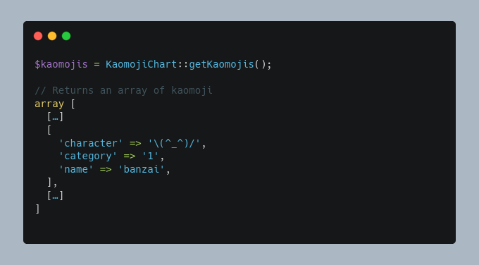

# Kaomoji Chart

[](https://packagist.org/packages/pixelbrackets/kaomoji-chart/)
[](https://gitlab.com/pixelbrackets/kaomoji-chart/pipelines)
[](https://gitlab.com/pixelbrackets/kaomoji-chart#requirements)
[](https://spdx.org/licenses/GPL-2.0-or-later.html)

This package provides a static list of [Kaomoji](https://de.wikipedia.org/wiki/Kaomoji).

The object returns an array which contains a Kaomoji string, a unique name,
and a category.



## Requirements

- PHP

## Installation

Packagist Entry https://packagist.org/packages/pixelbrackets/kaomoji-chart/

## Source

https://gitlab.com/pixelbrackets/kaomoji-chart/

## Usage

See [tests/demo.php](./tests/demo.php)

1. Get an array with all Kaomojis
   ```php
   $colorChart = new \Pixelbrackets\KaomojiChart\KaomojiChart();
   $kaomojis = $colorChart->getKaomojis();
   ```
    Or as static method call
   ```php
   $kaomojis = \Pixelbrackets\KaomojiChart\KaomojiChart::getKaomojis();
   ```
1. Get an array with all categories
   ```php
   $categories = \Pixelbrackets\KaomojiChart\KaomojiChart::getCategories();
   ```
1. Get an array with all Kaomojis grouped by category
   ```php
   $groupedKaomojis = \Pixelbrackets\KaomojiChart\KaomojiChart::getKaomojisGroupedByCategory();
   ```
1. Get an array of a single Kaomoji
   ```php
   $kaomoji = \Pixelbrackets\KaomojiChart\KaomojiChart::getKaomoji('banzai');
   ```

## License

GNU General Public License version 2 or later

The GNU General Public License can be found at http://www.gnu.org/copyleft/gpl.html.

## Author

Dan Untenzu (<mail@pixelbrackets.de> / [@pixelbrackets](https://pixelbrackets.de))

## Changelog

See [./CHANGELOG.md](CHANGELOG.md)

## Contribution

This script is Open Source, so please use, patch, extend or fork it.
